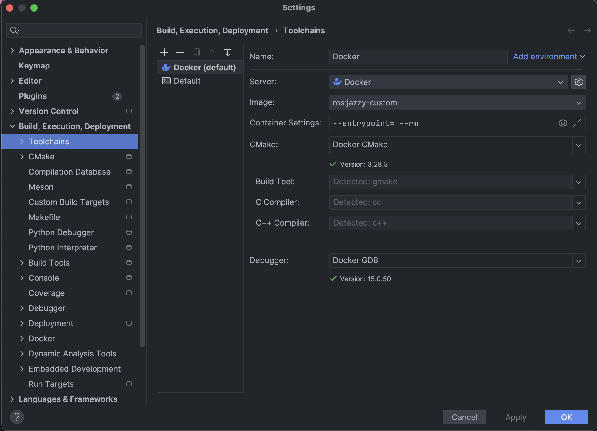
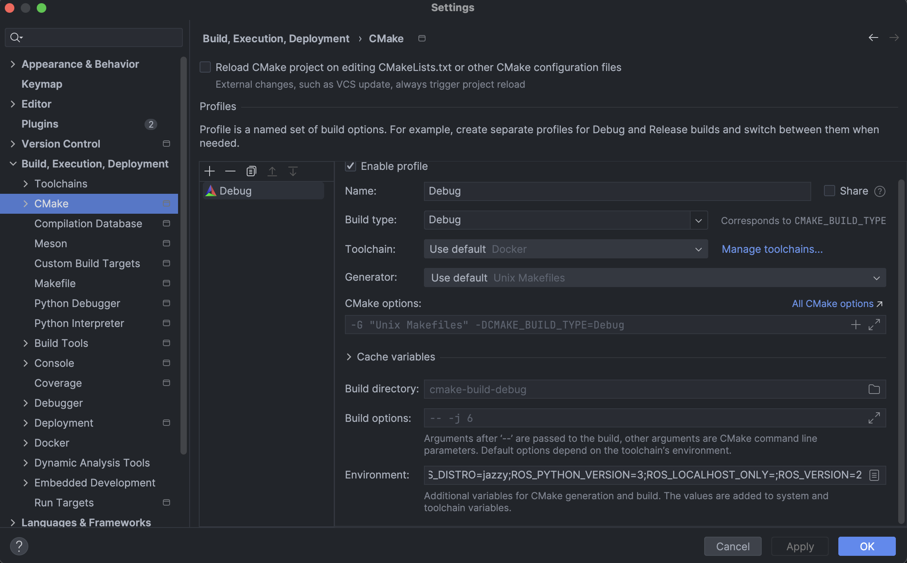
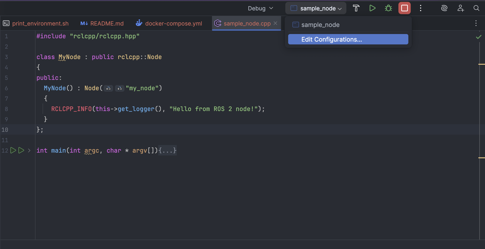

# Setting up ROS 2 for C++ development on macOS with CLion

This is a guide to set up ROS 2 for C++ development on macOS using CLion with Docker Toolchains.
At the time I wrote this guide, I used ROS 2 Jazzy distribution and CLion 2025.1.1, but the steps should be similar for other distributions.
The guide uses a sample ROS 2 project to verify that everything works correctly.

#### 1. Build the Docker image

In the main project folder, open a terminal window and run `docker-compose up`. This will build the Docker image for the first time, using the ROS 2 Jazzy distribution.

When the image has finished building, you should see a string starting with:

```
AMENT_PREFIX_PATH=<...continues here...>
```

Save this string for the next step.

#### 2. Set up CLion

First, you need to set up the toolchain in CLion. Go to **Settings -> Build, Execution, Deployment -> Toolchains**. Click on the + Button to add a new toolchain, then select "Docker". **Make sure to set this new toolchain as "Default".**
If you have successfully build the Docker image in Step 1, most of the fields in this panel should automatically fill in.



Once the toolchain is set up, you need to configure the environment of CMake. Go to **Settings -> Build, Execution, Deployment -> Toolchains**.
In the "Environment" field, paste the string obtained in Step 1.



#### 3. Verify that the environment is set up correctly

If everything went well, C++ headers should be visible from your host machine, with code hints, auto-completion, and no errors.
You can verify that everything works correctly by opening the `src/sample_node.cpp` and running the main function. You should see a console message saying "Hello from ROS 2 node!"

If you still see errors, you can try invalidating the caches of CLion (**File -> Invalidate Caches**) and restarting CLion.
You can also try to delete the build folders, or reloading the CMake Project (**File -> Reload CMake Project**). Otherwise, check the troubleshooting section below.


## Troubleshooting

#### "error while loading shared libraries: liblibstatistics_collector.so: cannot open shared object file: No such file or directory"

If you have an error like this when attempting to run the main file, go to **Edit configurations**:



In "Environment variables" add: `LD_LIBRARY_PATH=/opt/ros/jazzy/lib`. This should match the LD_LIBRARY_PATH environment variable that appears in the string in Step 1, without the host machine volume.

Note: changing the entry point might reset the configuration. To avoid having to add this environment variable for every new entry point, you can edit the configuration template in **Edit Configurations -> Edit configuration templates** (in the bottom left of the window).